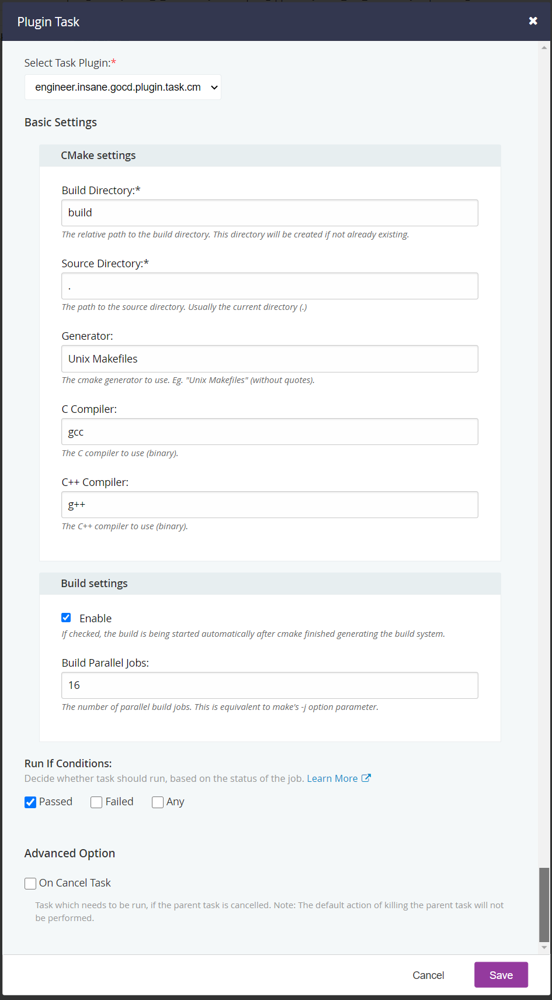

# GoCD CMake Task Plugin

This is a plugin for [GoCD](https://gocd.org) providing a task for building CMake based projects (mainly C/C++ projects).

## Installation
Download the JAR of the latest release [here](https://github.com/Tectu/gocd-cmake-task/releases) and place it under `<gocd_installation_directory>/plugins/external` and restart the server. The plugin
should show up in the plugins list of the administration site.

See the [official GoCD documentation](https://docs.gocd.org/current/extension_points/plugin_user_guide.html#installing-and-uninstalling-of-plugins) for more information about plugins.

## Usage
In a pipeline job supposed to use this plugin, add a new `Plugin Task`. Select this plugin from the dropdown.

### Config
The task configuration view looks like this:



CMake settings:

| Settings | Key | Sample Value | Description |
| :--- | :--- | :--- | :--- |
| Build type | `build_type` | `Release` | The build type to perform. Usually `Release` or `Debug`. |
| Build directory | `build_directory` | `build` | The build directory relative to the pipeline directory |
| Source directory | `source_directory` | `.` | The source directory relative to the pipeline directory |
| Generator | `generator` | `Unix Makefiles` | The buildsystem generator to use |
| C Compiler | `compiler_c` | `gcc` | The C compiler to use (This value will be assigned to `CMAKE_C_COMPILER`) |
| C++ Compiler | `compiler_cpp` | `g++` | The C++ compiler to use (This value will be assigned to `CMAKE_CXX_COMPILER`) |

Build settings:

| Settings | Key | Sample Value | Description |
| :--- | :--- | :--- | :--- |
| Enable | `perform_build` | `true` | Whether to launch the build after cmake successfully generated the buildsystem |
| Parallel Jobs | `build_parallel_jobs` | `16` | The number of parallel jobs to use when building |

CPack settings:

| Settings | Key | Sample Value | Description |
| :--- | :--- | :--- | :--- |
| Enable | `cpack_enable` | `true` | Whether to run CPack after successful building. |
| Package File Name | `cpack_package_file_name` | `myproject_linux_gcc_x86_64` | The name of the resulting package file. This value will be assigned to `CPACK_PACKAGE_FILE_NAME`). |

## Building
Build with:
```shell script
./gradlew clean test assemble
```
